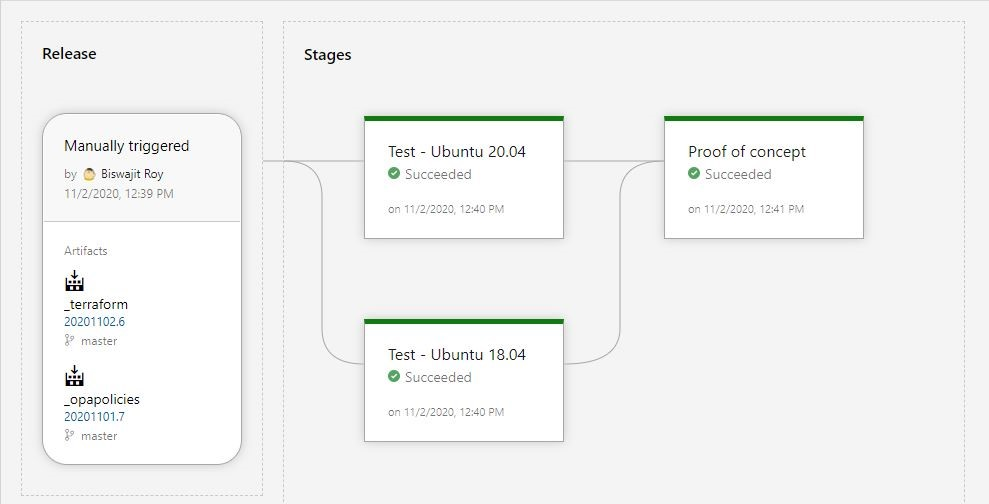

## Terraform - Azure build pipeline 

#### About the pipeline
The repository contains sample `.tf` files that can be developed/maintained by developers and have changes pushed for `terraform plan` and `terraform apply` on test or production environments.

The pipeline will build azure artifacts of files and store them. Later, when a release pipeline is run, these artifacts can be downloaded and executed accordingly.

#### Sample build release structure

